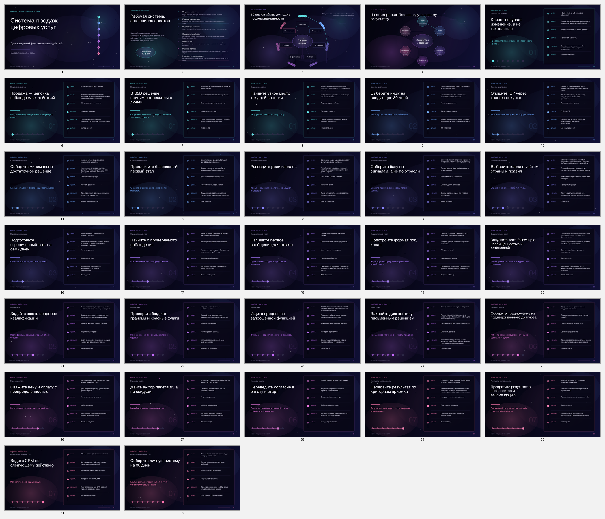

# Система продаж цифровых услуг

Исходники интерактивного Galaxy-курса и синхронизированной презентации.

- 7 последовательных модулей и 28 шагов;
- единый канонический контент для сайта и презентации;
- большая навигационная паутина, progress и диагностический выбор;
- React Bits: Galaxy, BorderGlow, SpotlightCard, LineSidebar, OptionWheel, SplashCursor, GhostCursor, LaserFlow, TrueFocus, DecryptedText и другие;
- отдельная Galaxy-страница 404;
- презентация из 32 слайдов с заметками спикера.



## Быстрый запуск сайта

Требования: Node.js 20+ и npm.

```bash
npm ci
npm run dev:site
```

Vite покажет локальный адрес, обычно `http://localhost:5173`.

Production build:

```bash
npm run build:site
```

Готовый переносимый сайт и PPTX приложены к GitHub Release `v1.0.0`.

## Проверки

```bash
npm test
npm run build:site
```

Финальная поставка дополнительно проверена на parity, геометрию слайдов, desktop/mobile, accessibility, 404, ZIP и SHA-256. Подробности: [qa/FINAL-QA.md](qa/FINAL-QA.md).

## Структура

- `packages/course-content/` — единственный источник учебного содержания;
- `apps/site/` — React/Vite-сайт;
- `apps/deck/` — генератор и тесты презентации;
- `research/` — реестр источников и методические заметки;
- `scripts/` — parity, упаковка и проверки артефактов;
- `qa/` — отчёты финальной проверки;
- `docs/HANDOFF.md` — карта проекта для следующего специалиста.

## Презентация

Исходный генератор находится в `apps/deck/src/`. Он использует `@oai/artifact-tool` из среды Codex. Если этой среды нет, редактируйте готовый PPTX из GitHub Release: все элементы презентации являются нативными редактируемыми фигурами и текстовыми блоками.

Проверка генератора внутри Codex-среды:

```bash
npm run test:runtime -w @sales-course/deck
npm run build:deck
```

## Контент и визуальные компоненты

Сайт и презентация получают данные из `packages/course-content/src/`. Менять содержание отдельно в приложениях не следует.

Компоненты React Bits находятся в `apps/site/src/components/react-bits/`. Их происхождение и контрольные суммы описаны в `apps/site/react-bits-manifest.json`; условия использования — в `apps/site/THIRD_PARTY_NOTICES.md` и `apps/site/licenses/React-Bits-LICENSE.md`.

Публичный доступ к репозиторию сам по себе не заменяет отдельное разрешение правообладателя на коммерческое переиспользование авторской части проекта.
